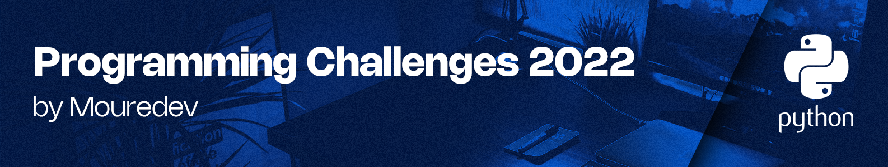

[Programming Challenges (Retos de Programación)](https://retosdeprogramacion.com/semanales2022) are a series of exercises proposed by [Mouredev](https://mouredev.com/), a Spanish software engineer and content creator. Throughout the year, a new exercise is proposed every week with the goal of improving our programming logic and skills.

This repository gathers my solutions for the proposed exercises using **Python** as the programming language.

## List of exercises

1. FizzBuzz
2. Is anagram?
3. Fibonacci sequence
4. Is prime number?
5. Polygons area
6. Aspect ration of an image
7. Reversing strings
8. Counting words
9. Decimal to binary
10. Morse code
11. Balanced expressions
12. Deleting characters
13. Is palindrome?
14. Recursive factorial
15. Is armstrong number?
16. How many days?
17. To uppercase
18. Obstacles race
19. Tic Tac Toe
20. Time conversor
21. Stopping time
22. Txt. calculator
23. Sets
24. Greatest common divisor & Least common multiple
25. Iteration master
26. Rock, paper, scissors
27. Square & Triangle 2D
28. Orthogonal vectors
29. Vending machine
30. Sort list
31. Words frame
32. Leap years
33. Second greatest number
34. Chinese sexagenary cycle
35. Lost numbers
36. Pokemon battle
37. Rings of power
38. The legend of zelda releases
39. Binary to decimal
40. Top algorithms: Quick sort
41. Pascal triangle
42. Ohm's Law
43. Temperature conversor
44. Trick or treat
45. Boomerangs
46. Water container
47. Where is the robot?
48. Most common vowel
49. 2022 aDEVent calendar
50. Handles detector
51. Karaca encryption

## View the solutions

Each exercise is located within the corresponding folder for each week. Also, each exercise has its own branch.

or

Run this command to clone the project and review and execute the command locally.

`https://github.com/santiagoTorres27/Programming-Challenges-2022-by-Mouredev-Python.git`
